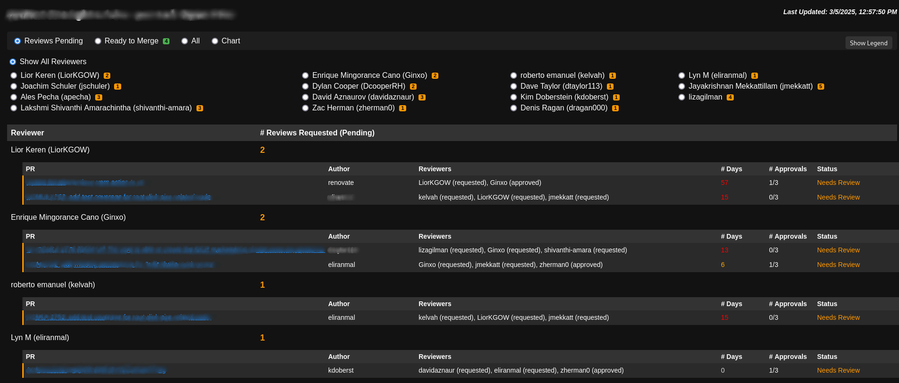

# Pull Request Composite Actions

This repository contains a set of [GitHub Composite Actions](https://docs.github.com/en/actions/sharing-automations/creating-actions/creating-a-composite-action)

## Pull Request Review Report

This composite action creates a webpage for the repository to make eaiser the pull request review status per repository contributor.



### How to use

Create a new GitHub Action workflow on the repository you want, like

```
name: Pull Request Review Report

on:
  schedule:
    - cron: '*/5 * * * *'  # Runs every 5 minutes
  workflow_dispatch:  # Allows manual triggering

jobs:
  generate-report:
    name: Generate Pull Request Review Report
    runs-on: ubuntu-latest
    concurrency:
      group: pr-review-report
      cancel-in-progress: true
    steps:
      - name: Checkout repository
        uses: actions/checkout@v3
        with:
          token: ${{ secrets.PR_REVIEW_TOKEN }}

      - name: Generate PR review report
        uses: dtaylor113/ocmui-pr-review-report@main
        with:
          owner: "RedHatInsights"
          name: "uhc-portal"
          token: ${{ secrets.PR_REVIEW_TOKEN }}
```

// TODO: the GitHub page configuration is missing here